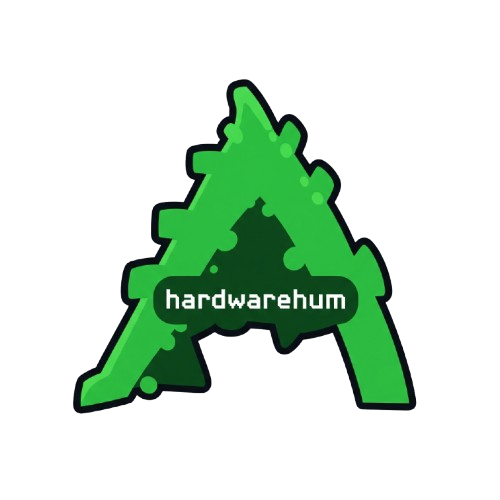

> [!CAUTION]
> The only official repository of HardwareHum is https://github.com/HardwareHum/hardwarehum.github.io any other repositories are modifications of this code or even fake repositories pretending to be us. Do not run any unknown modification of this code, it may not be safe.

<h1>
  
  HardwareHum
</h1>

This repository hosts a Roblox executor script written in Luau, designed to run client-side scripts in Roblox games through supported executors.

## About This Script

This project is fully **open source** and **modifiable**. You are encouraged to explore, learn from, and customize the script to fit your needs. Whether you want to add features, fix bugs, or adapt it for specific Roblox executor environments, feel free to fork and improve it.

## License & Attribution

While this script is open for modification and redistribution, it is licensed under the **MIT License**, which requires that:

- You must **credit the original author(s)** whenever you use, share, or distribute this script or any derivative work.
- You may **not claim this script or derivatives as your original work**.
- Any redistribution of this script, modified or not, must include this license and attribution.

**Taking credit or publishing this code without attribution violates the license and can be subject to takedown requests.**

## Responsible Use

This script is intended strictly for educational, testing, and personal use in Roblox executor environments. Please use it responsibly and ethically.

---

If you find this script reposted without proper credit or under a different name, please notify the repository owner or the platform hosting the unauthorized copy.

git commit --allow-empty -m "Trigger redeploy"
git push
